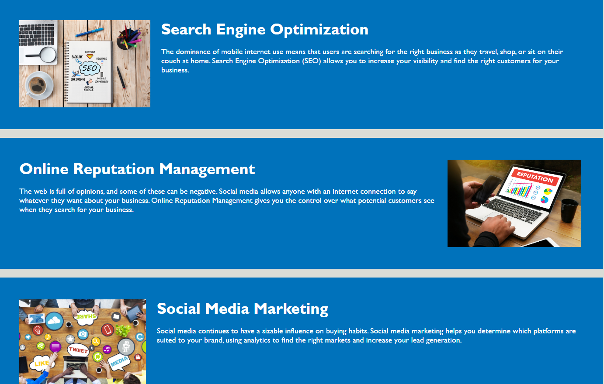
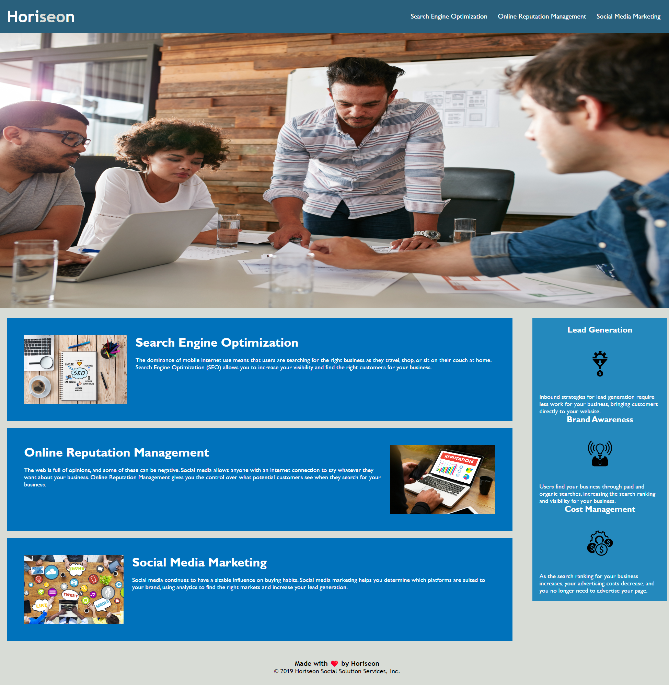

# refactoring

## Description

- My motivation for this project was to test my own skills in coding and seeing how proficient i can make anothers code whilst also point out errors, mistakes and getting rid of wasted space within ones code.
- The reason i build this project was to see how far my coding skills have come along with the few lectures that we have had
- The problem i sloved was making the html code more semantic,  whilst also making sure the css elements matched the html elements and trying my best to not change much on the websites integirty
- i learned a lot about what semantic tags are and new onse like asside and artcle and how and when to use them.  I also learned the difference between putting a space between something in css and putting a comma inbetween it

Html fixes
- Got rid of all div elements
- Added section, article, header, footer, img, nav, h1-h3, figure, and aside elements to the file to make it more semantic
- Deleted some few blocks of code to make look cleaner
- Added commenting to be able to follow along with the changes

CSS
- Condensed a lot of code, getting rid of extra line where they were not needed
- Changed a majority of the classes to html elements in order to keep the same structure
- Added a font size to h3 for a cleaner look and to also follow the pattern of h1 being the biggest font size descending to h3 as the smallest
- Added commenting to follow along with changes created

## Installation

N/A

## Usage

The usage for this website is th have information about horiseon in an easy and accessible way, it also has links in the top right corner which take you to the afflited box depending on which link you clicked
, 

## Credits

N/A

## License

MIT License

Copyright (c) [2023] [Albi Krasniqi]

Permission is hereby granted, free of charge, to any person obtaining a copy
of this software and associated documentation files (the "Software"), to deal
in the Software without restriction, including without limitation the rights
to use, copy, modify, merge, publish, distribute, sublicense, and/or sell
copies of the Software, and to permit persons to whom the Software is
furnished to do so, subject to the following conditions:

The above copyright notice and this permission notice shall be included in all
copies or substantial portions of the Software.

THE SOFTWARE IS PROVIDED "AS IS", WITHOUT WARRANTY OF ANY KIND, EXPRESS OR
IMPLIED, INCLUDING BUT NOT LIMITED TO THE WARRANTIES OF MERCHANTABILITY,
FITNESS FOR A PARTICULAR PURPOSE AND NONINFRINGEMENT. IN NO EVENT SHALL THE
AUTHORS OR COPYRIGHT HOLDERS BE LIABLE FOR ANY CLAIM, DAMAGES OR OTHER
LIABILITY, WHETHER IN AN ACTION OF CONTRACT, TORT OR OTHERWISE, ARISING FROM,
OUT OF OR IN CONNECTION WITH THE SOFTWARE OR THE USE OR OTHER DEALINGS IN THE
SOFTWARE.

## Visual

